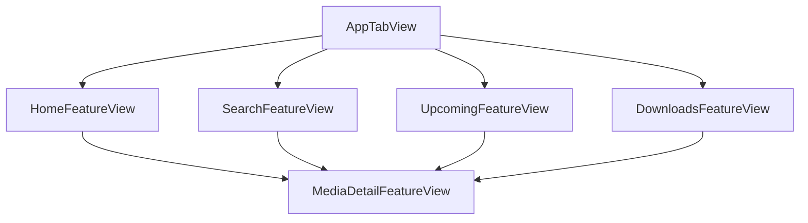

# Blossom Movie App - Feature-Based Architecture

## 📁 Project Structure

The app has been refactored to use a **feature-based folder structure** for better scalability, maintainability, and team collaboration.

```
BlossomMovie/
├── App/
│   ├── BlossomMovieApp.swift           # App entry point
│   └── AppTabView.swift                # Main tab container
│
├── Features/
│   ├── FeatureModules.swift            # Feature documentation & registration
│   ├── Home/
│   │   ├── HomeFeatureView.swift       # Feature entry point
│   │   └── Views/
│   │       ├── HomeView.swift          # Main home view
│   │       ├── HomeContentView.swift   # Content layout
│   │       └── Components/             # Home-specific components
│   │           ├── HomeHeroView.swift
│   │           ├── HomeMediaSectionView.swift
│   │           └── HomeActionButton.swift
│   │
│   ├── Search/
│   │   ├── SearchFeatureView.swift
│   │   └── Views/
│   │       ├── SearchView.swift
│   │       ├── SearchResultsView.swift
│   │       └── Components/
│   │           ├── SearchResultCard.swift
│   │           ├── SearchMediaTypeButton.swift
│   │           └── SearchEmptyStateView.swift
│   │
│   ├── Upcoming/
│   │   ├── UpcomingFeatureView.swift
│   │   └── Views/
│   │       ├── UpcomingView.swift
│   │       ├── UpcomingContentView.swift
│   │       └── Components/
│   │           ├── UpcomingMovieRow.swift
│   │           └── UpcomingEmptyStateView.swift
│   │
│   ├── Downloads/
│   │   ├── DownloadsFeatureView.swift
│   │   └── Views/
│   │       ├── DownloadsView.swift
│   │       ├── DownloadsContentView.swift
│   │       └── Components/
│   │           ├── DownloadItemRow.swift
│   │           ├── DownloadDeleteButton.swift
│   │           └── DownloadsEmptyStateView.swift
│   │
│   └── MediaDetail/
│       ├── MediaDetailFeatureView.swift
│       └── Views/
│           ├── MediaDetailView.swift
│           └── Components/
│               ├── MediaDetailHeroView.swift
│               ├── MediaDetailPlayButton.swift
│               ├── MediaDetailContentView.swift
│               ├── MediaDetailHeaderView.swift
│               ├── MediaDetailActionButtonsView.swift
│               └── MediaDetailInfoViews.swift
│
├── Shared/
│   ├── UIComponents/                   # Reusable UI components
│   │   ├── LoadingView.swift
│   │   ├── ErrorView.swift
│   │   ├── MediaPosterView.swift
│   │   ├── ButtonStyles.swift
│   │   └── WebView.swift
│   ├── ViewModels/                     # Shared view models
│   └── Models/                         # Shared models
│
├── Domain/
│   └── Models/
│       └── MediaItem.swift             # Core domain model
│
├── Data/
│   ├── Repositories/
│   │   └── MediaRepository.swift       # Data access layer
│   ├── Network/
│   │   └── NetworkService.swift        # Network layer
│   └── Cache/
│       └── CacheService.swift          # Caching layer
│
├── Infrastructure/
│   ├── DependencyInjection/
│   │   └── DependencyContainer.swift   # DI container
│   ├── Logger/
│   │   └── Logger.swift                # Logging service
│   └── Constants/
│       └── AppConstants.swift          # App-wide constants
│
├── Configuration/
│   └── ConfigurationManager.swift      # Environment configuration
│
└── Tests/
    └── BlossomMovieTests/
        ├── ViewModelTests.swift        # Unit tests
        └── Mocks/
            └── MockServices.swift      # Test mocks
```

## 🏗️ Architecture Benefits

### 1. **Feature Isolation**
- Each feature is self-contained with its own views and components
- Changes in one feature don't affect others
- Easy to add/remove features

### 2. **Team Scalability**
- Multiple developers can work on different features simultaneously
- Clear ownership and responsibility boundaries
- Reduced merge conflicts

### 3. **Code Reusability**
- Shared components prevent code duplication
- Common UI patterns are centralized
- Consistent design system

### 4. **Testing & Maintenance**
- Features can be tested independently
- Clear dependency boundaries
- Easier debugging and troubleshooting

### 5. **Performance**
- Lazy loading of feature modules
- Reduced build times for feature-specific changes
- Better memory management

## 🎯 Feature Overview

### 🏠 **Home Feature**
- **Purpose**: Main landing screen with trending content
- **Components**: Hero section, media carousels, action buttons
- **Navigation**: Links to MediaDetail feature

### 🔍 **Search Feature**  
- **Purpose**: Movie and TV show discovery
- **Components**: Search bar, results grid, media type toggle
- **Features**: Real-time search, debouncing, error handling

### 📅 **Upcoming Feature**
- **Purpose**: Upcoming movie releases
- **Components**: List view with release dates and details
- **Features**: Date formatting, pull-to-refresh

### 📱 **Downloads Feature**
- **Purpose**: User's saved content management
- **Components**: Download list, delete functionality, empty states
- **Features**: SwiftData integration, confirmation dialogs

### 🎬 **MediaDetail Feature**
- **Purpose**: Detailed movie/TV show information
- **Components**: Hero video, metadata, trailer player
- **Features**: YouTube integration, download management

## 🔄 Navigation Flow



## 📋 Implementation Guidelines

### Adding a New Feature

1. **Create Feature Folder Structure**
```
Features/NewFeature/
├── NewFeatureView.swift
├── Views/
│   ├── NewFeatureView.swift
│   └── Components/
└── ViewModels/ (if needed)
```

2. **Implement Feature Entry Point**
```swift
struct NewFeatureView: View {
    @Environment(\.dependencies) private var dependencies
    @State private var navigationPath = NavigationPath()
    
    var body: some View {
        NavigationStack(path: $navigationPath) {
            NewFeatureMainView(navigationPath: $navigationPath)
        }
    }
}
```

3. **Add to AppTabView**
```swift
Tab("New Feature", systemImage: "icon.name") {
    NewFeatureView()
}
```

4. **Register in FeatureModules.swift**
```swift
enum AppFeatures: String, CaseIterable {
    case newFeature = "NewFeature"
}
```

### Component Guidelines

- **Feature-specific components** go in `Features/FeatureName/Views/Components/`
- **Shared components** go in `Shared/UIComponents/`
- Use clear, descriptive naming conventions
- Include SwiftUI previews for all components

### Dependency Management

- Use the centralized `DependencyContainer`
- Access dependencies via `@Environment(\.dependencies)`
- Keep feature dependencies minimal and explicit

### Testing

- Create feature-specific test suites
- Use mock services for isolated testing
- Test navigation flows and user interactions

## 🚀 Migration Benefits

This refactoring provides:

✅ **Better Organization** - Clear separation of concerns  
✅ **Improved Scalability** - Easy to add new features  
✅ **Enhanced Collaboration** - Multiple developers can work simultaneously  
✅ **Reduced Complexity** - Isolated feature development  
✅ **Better Testing** - Independent feature testing  
✅ **Consistent Patterns** - Standardized feature structure  

The app maintains all existing functionality while providing a more maintainable and scalable architecture for future development.